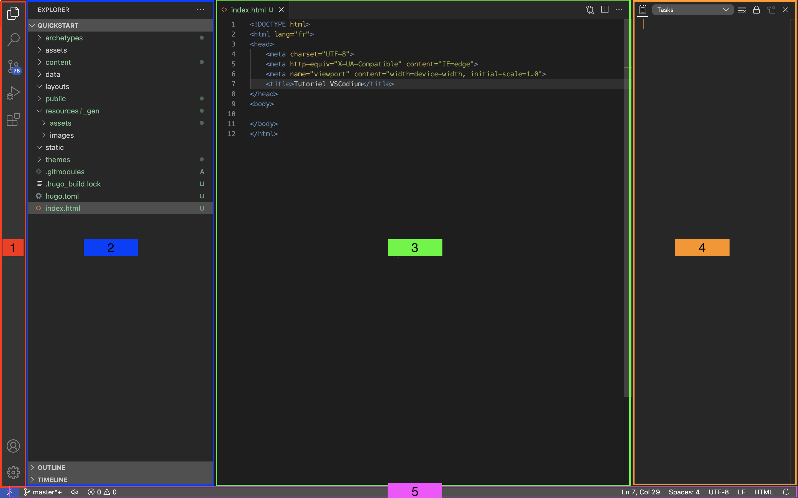

+++
title = "Vscodium: Introduction à l'interface"
date = "2023-06-02T09:43:18+02:00"
author = "James"
authorTwitter = "" #do not include @
cover = ""
tags = []
keywords = ["", ""]
description = ""
showFullContent = false
readingTime = false
hideComments = false
color = "" #color from the theme settings
summary = "Odile, c'est où qu'on clique déjà ?"
+++

## Barre d'activité (1/Rouge)

Affiche les icônes qui vont permettre de changer la vue affichée de la barre
latérale principale. En fonction des extensions installées, on peut y voir plus
ou moins d'éléments.

On peut masquer cette barre si on est suffisament à l'aise pour naviguer au clavier.

## Barre latérale principale (2/Bleu)

Affichage et disparition avec `ctrl+b`. Il permet d'afficher notamment les vues
suivantes : 

### L'explorateur de fichier (CTRL + SHIFT + E)

Affiche les différents fichiers et répertoires du projet par défaut, dans la
capture on voit `Quickstart` il s'agit du nom du répertoire ouvert actuellement.

Lorsque le curseur est positionné à l'intérieur de la barre latérale, on voit
apparaître quatre icônes au même niveau que `Quickstart`, ils permettent de
créer un fichier, créer un répertoire, rafraîchir la liste des fichiers et
répertoires (fait automatiquement normalement) et réduire tous les dossiers
ouverts.

Un simple clic sur un fichier l'ouvre en mode temporaire (on voit que l'onglet
est en italique). Si on ouvre un autre fichier avec un simple clic, il viendra
prendre l'onglet du premier fichier. Pour garder ouvert les fichiers il faut
double cliquer à l'ouverture ou cliquer sur l'onglet du fichier ouvert en simple clic.

En dessous on voit le tiroir `Outline` qui permet de voir la hiérarchie du
document actuellement affiché.

Enfin, en dessous nous avons `Timeline` qui permet d'afficher l'historique
d'édition du document actuellement affiché. Attention, il ne s'agit pas d'un
outil de gestion des sources comme Git.

### La recherche globale (CTRL + SHIFT + F)

La recherche globale permet de faire une recherche dans l'ensemble des fichiers
du répertoire.

Par défaut la recherche est insensible à la casse, on peut contraindre le
respect de la casse avec le premier icône. 

Aussi, par défaut la recherche va chercher l'expression recherchée y compris à
l'intérieur d'un mot. Pour forcer la reherche à prendre en compte le mot complet
uniquement on sélectionne le deuxième icône.

Enfin le dernier icône permet d'activer une recherche avec des expressions régulières.

### Gestion du code source (CTRL + SHIFT + G)

Permet de piloter le gestionnaire de source Git en mode graphique pour le projet
actuellement ouvert. 

### Les extensions (CTRL + SHIFT + X)

On voit ici la liste des extensions déjà installés et on peut en rajouter
d'autres.

Les extensions permettent d'étendre VSCodium avec un support avancé de très
nombreux langages, au-delà d'une simple coloration syntaxique par défaut. Avec
les extensions on bénéficie (entre autres) de l'analyse du code pour les
erreurs, la navigation par symboles, l'affichage de la documentation, le
lancement et le débug et la factorisation intelligente.

La popularité de VSCodium fait en que tout développeur d'un nouveau langage
implémente très rapidement une extension pour inciter les développeurs à l'adopter.

L'intérêt de naviguer ici lorsqu'on a son environnement déjà configuré est de
pouvoir désactiver ou réactiver temporairement une extension qui bloquerait sur
un projet particulier ou dont on a besoin que ponctuellement. C'est rarement
nécessaire toutefois VSCodium est suffisament optimisé pour que les performances
ne soient pas vraiment problématiques.

### Le lanceur (CTRL + SHIFT + D)

Permet de lancer ou débugger une application en fonction de profils pré-définis.

## La zone d'édition (3/Vert)

C'est ici qu'on retrouve le contenu du document que l'on est en train d'éditer
avec les numéros de ligne sur la gauche.

La "mini-carte" permet de voir à grosse maille le document afin d'y naviguer
plus facilement de manière visuelle.

## Barre de statut (5/Violet)

On retrouve ici pléthode d'information qui changera dynamiquement en fonction du
type de projet dans lequel on se trouve et du langage utilisé.

On y trouve notamment des informations sur la gestion des sources, les erreurs
ou avertissement du projet, la ligne et colonne du curseur et des informations
relatives au fichier : nombre d'espaces par tabulation, encodage, caractère de
fin de ligne et le format de fichier que VSCodium a détecté.

## Barre latérale secondaire (4/Orange)

Masqué par défaut permet d'afficher d'autres vues selon les besoins du
développeur.